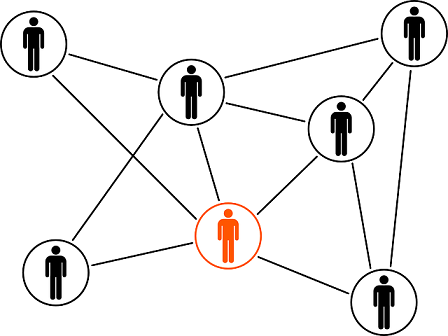
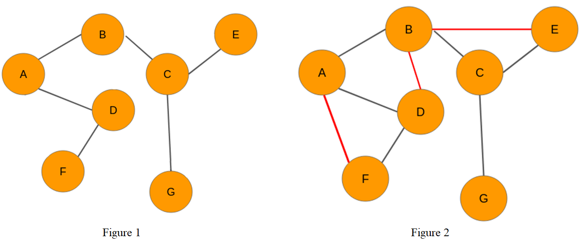

# Link prediction in Social Networks

Have you ever wondered who your next Facebook connection might be? Curious who the next request might come from?What if I told you there was a way to predict this? Social networks such as facebook can be represented by graphs in which users can represent eith nodes and relationships with edges. Link prediction is one of the most important research topics in the area of graphs and networks. The purpose of link prediction is to identify pairs of nodes that will form a link in the future. In this work we used the topology of undirected graphs from social networks to export features with which we trained classification supervised learning algorithms.

## Preamble

Author: Constandinos Demetriou

Supervisor: Dr. [Charalampos Tsourakakis](https://tsourakakis.com/)

Copyright (c) 2021

This program is free software: you can redistribute it and/or modify it under the terms of the GNU General Public
License as published by the Free Software Foundation, either version 3 of the License, or (at your option) any later
version.

This program is distributed in the hope that it will be useful, but WITHOUT ANY WARRANTY; without even the implied
warranty of MERCHANTABILITY or FITNESS FOR A PARTICULAR PURPOSE. See the GNU General Public License for more details.

You should have received a copy of the GNU General Public License along with this program.
If not, see [http://www.gnu.org/licenses/]([http://www.gnu.org/licenses/)

## Introduction
Link prediction is one of the most important research topics in the field of graphs and networks. The objective of link prediction is to identify pairs of nodes that will either form a link or not in the future.



Link prediction has a ton of use in real-world applications. Here are some of the important use cases of link prediction:
* Predict which customers are likely to buy what products on online marketplaces like Amazon. It can help in making better product recommendations
* Suggest interactions or collaborations between employees in an organization
* Extract vital insights from terrorist networks

In network theory, link prediction is the problem of predicting the existence of a link between two entities in a network. The Figure 1 shows a non-directed graph at a given time t. On the other hand, the Figure 2 shows the same graph at time t + n. We observe that in a future time t + n three edges are added between the nodes which are shown in red. Our goal in this work is to predict these edges that will be added to the graph.



If we could represent a graph in the form of a structured dataset with a set of features, then we could use machine learning algorithms to predict the formation of links between unrelated pairs of nodes in the graph.

## Data
In this work, datasets with non-directed graphs from [SNAP](https://snap.stanford.edu/data/) and [KONECT](http://konect.cc/networks/) databases were used. Graphs related to social networks were selected:
* **hamsterster:** this network contains friendships and family links between the users of the website hamsterster.com with the nodes representing the users and the edges representing the friendship relationship between the users
* **twitch:** is a network of Twitch users consisting of gamers who stream to a specific language with the nodes being the users themselves and the edges being friendships with each other
* **github:** is the membership network of the software development hosting site GitHub. The network is bipartite and contains users and projects, with links denoting that a user is a member of a project.
* **deezer:** is a music streaming service where the nodes represent the users and the edges are mutual friendships
* **facebook:** contains friendship data of Facebook users. A node represents a user and an edge represents a friendship between two users. 
* **erdos:** a random graph

|Dataset| Number of nodes|Number of edges|Average degree|
| ------|:--------------:|:-------------:|:------------:|
|hamsterster|2426|16631|13.71|
|twitch|9498|153138|32.25|
|github|37700|289003|15.33|
|deezer|54573|498202|18.26|
|facebook|63731|817035|25.64|
|erdos|9967|30000|6.02|

## Feature Extraction
* Jaccard’s coefficient
* Adamic Adar
* Preferential attachment
* Clustering coefficient

## Supervised binary classification
* Logistic Regression
* k-Nearest Neighbors (kNN)
* Multilayer Perceptron (MLP)
* Decision Tree
* Random Forest
* Gaussian Naive Bayes

Installation
----
Make sure you have [python 3.8](https://www.python.org/downloads/release/python-380/)  installed in your system. 
The following command clone the repository.
```bash
git clone https://github.com/constandinos/link-prediction
cd link-prediction
```

Usage
---
#### erdos_graph.py
This class create a random undirect graph (erdos graph).
```bash
python erdos_graph.py <number of nodes> <number of edges>
eg. python erdos_graph.py 10000 30000
```

#### process_dataset.py
This class precess the graph and crete positive and negative edges.
```bash
python process_dataset.py <name of origin dataset>
eg. python process_dataset.py hamsterster.txt
<name of origin dataset> = {hamsterster.txt, twitch.txt, github.txt, deezer.txt, facebook.txt, erdos.txt}
```

#### visualization.py
This class visualize the graph and plot degree distribution.
```bash
python visualization.py <name of dataset with edges>
eg. python visualization.py hamsterster_edges.csv
<name of dataset with edges> = {hamsterster_edges.csv, twitch_edges.csv, github_edges.csv, deezer_edges.csv, facebook_edges.csv, erdos_edges.csv}
```

#### featurization.py
This class export features from an undirect graph.
```bash
python featurization.py <name of dataset with edges>
eg. python featurization.py hamsterster_edges.csv
<name of dataset with edges> = {hamsterster_edges.csv, twitch_edges.csv, github_edges.csv, deezer_edges.csv, facebook_edges.csv, erdos_edges.csv}
```

#### models.py
This class classify edges using supervised learning.
```bash
python models.py <name of dataset with features> <number of cpus>
eg. python models.py hamsterster_edges_features.csv 8
<name of dataset with features> = {hamsterster_edges_features.csv, twitch_edges_features.csv, github_edges_features.csv, deezer_edges_features.csv, facebook_edges_features.csv, erdos_edges_features.csv}
```

#### runAll.sh
This is a bash script to run all experiments together.
```bash
chmod +x runAll.sh
./runAll &
```

References
---
* [The Link Prediction Problem for Social Networks](http://www.cs.cornell.edu/info/people/kleinber/link-pred.pdf)
* [Link Prediction using Supervised Learning](https://archive.siam.org/meetings/sdm06/workproceed/Link%20Analysis/12.pdf)
* [Graph-based Features for Supervised Link Prediction](https://ieeexplore.ieee.org/stamp/stamp.jsp?arnumber=6033365&casa_token=NrziWKDlFlwAAAAA:Wn5gNsKT31w57DXMYofZpTlqNBLCF2LUjM9vaqCqNblL_mMZ9ZkPS6AK2bBvp7eYKTF1y38vakQ&tag=1)
